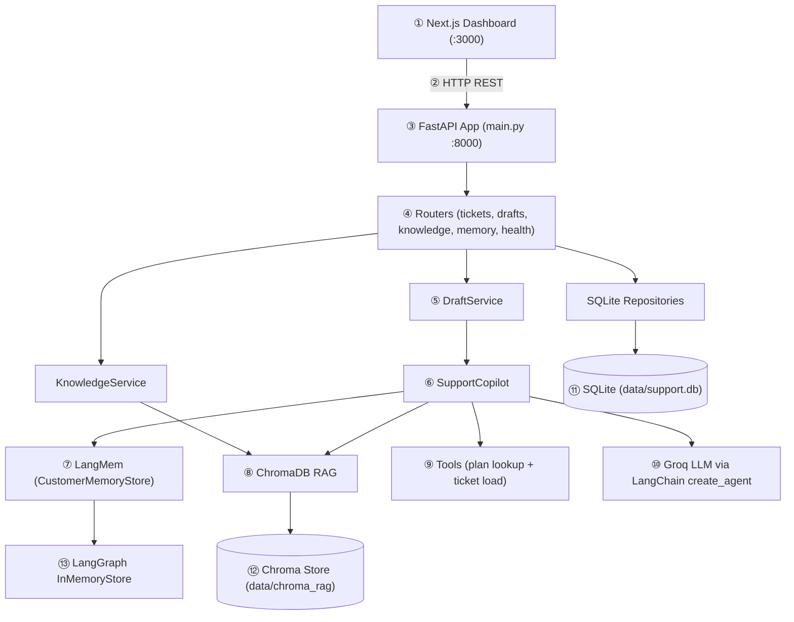
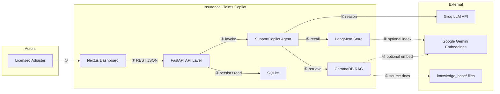
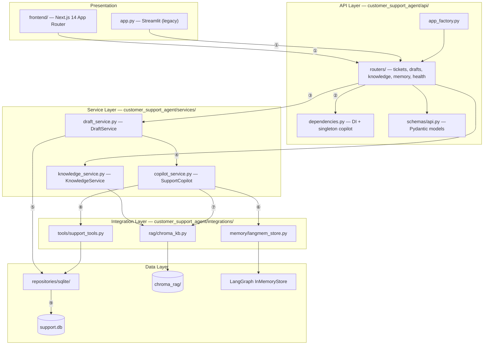
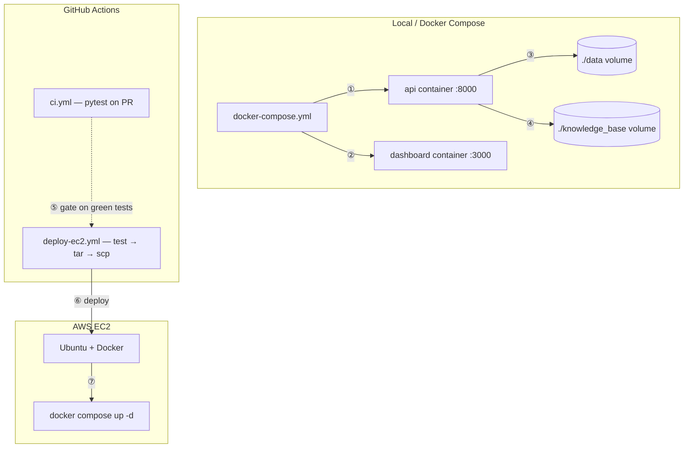
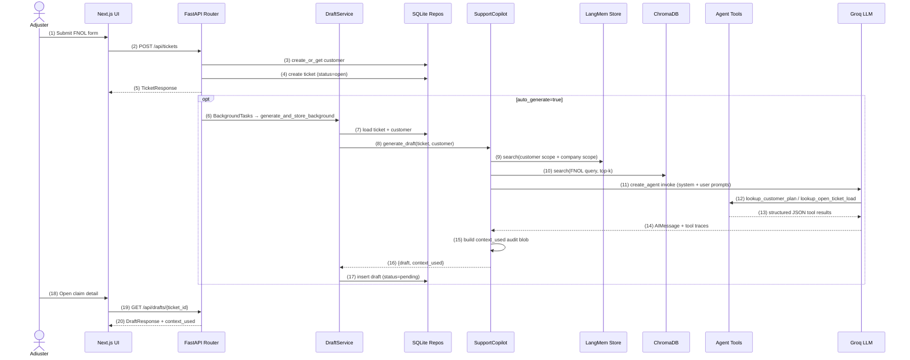
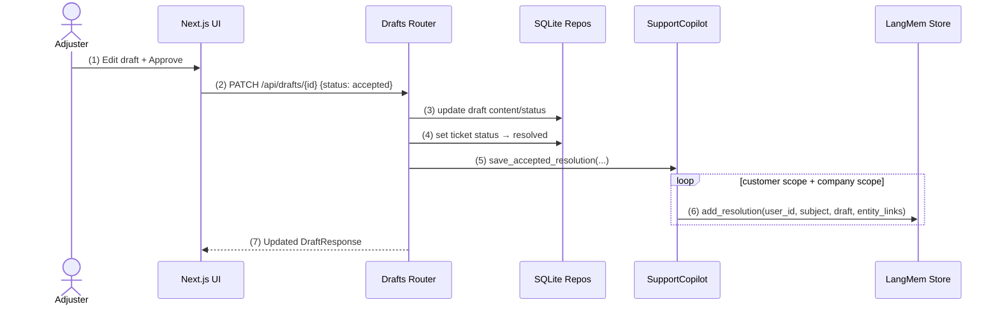
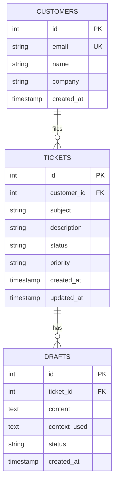
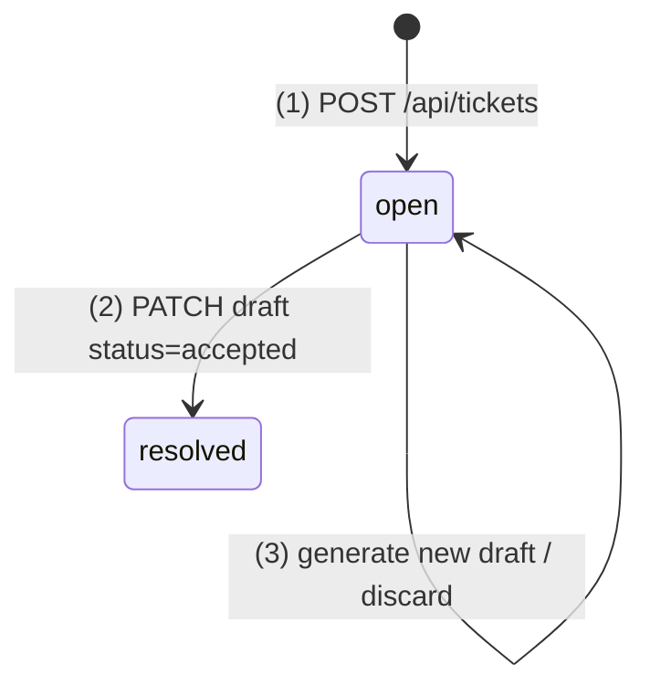
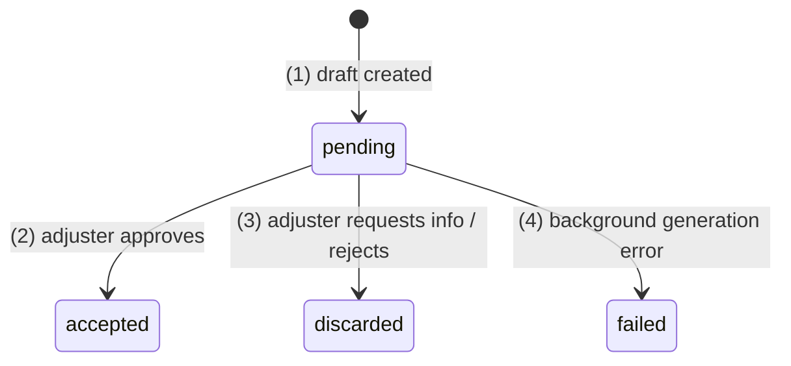

# Insurance Claims Copilot (LangMem)

An internal **human-in-the-loop** AI copilot for insurance claims adjusters. It accepts FNOL submissions, generates coverage recommendations using **LangChain agents**, **LangMem** long-term memory, and **ChromaDB RAG**, and lets licensed adjusters review and approve every draft before a claim is resolved.

Built to close the gap between upstream document/KYC automation and downstream claims operations — where adjusters still manually triage cases, search SOPs, and recall prior resolutions.

> **Not a customer-facing chatbot.** AI recommends; the adjuster decides.

---

## Why This Exists

| Layer | Problem at company | What this copilot solves |
|-------|-------------------|---------------------------|
| **Upstream (already solved)** | OCR + LLM extracted fields from ID/policy docs | — |
| **Downstream (the gap)** | Adjusters manually triage FNOL, search SOPs, recall prior cases | LangChain agent orchestrates multi-step reasoning with tools |
| **Context & memory** | Prior claim resolutions live in adjuster notes, not reusable | LangMem stores accepted resolutions per customer/company scope |
| **Policy knowledge** | SOPs and FAQs scattered across documents | ChromaDB RAG retrieves relevant KB chunks at draft time |
| **Compliance** | Black-box chatbots are risky in insurance | Licensed adjuster edits and approves every draft before resolution |
| **Operational checks** | Plan tier and open-claim load checked manually | Agent tools (`lookup_customer_plan`, `lookup_open_ticket_load`) |
| **Audit** | Regulators ask "why was this decision made?" | `context_used` JSON audit trail (memory + RAG + tool traces) |
| **Delivery** | AI logic tightly coupled to UI | FastAPI REST API decouples agent from Next.js / Streamlit frontends |
| **Deployment** | Needs repeatable demo/prod packaging | Docker Compose (API + dashboard) with health checks |

---

## Architecture



**Request path (numbered):** ① Adjuster UI → ② REST call → ③–④ API routing → ⑤ Draft orchestration → ⑥ Agent brain → ⑦–⑩ context retrieval, tools, LLM → ⑪–⑬ persistence layers.

### End-to-end workflow

Maps to **FNOL sequence steps (1)–(20)** in [LLD → Sequence — FNOL intake](#sequence--fnol-intake--draft-generation) below.

| Step | Seq # | Actor | Action | System behavior |
|------|-------|-------|--------|-----------------|
| 1 | 1–5 | Adjuster | Submits FNOL (claimant email, summary, description) | `POST /api/tickets` creates customer + ticket in SQLite |
| 2 | 6–17 | System | Triggers draft generation | `SupportCopilot.generate_draft()` runs |
| 3 | 9–10 | Agent | Retrieves context | Searches LangMem (customer + company scopes) and Chroma RAG (top-k KB chunks) |
| 4 | 12–13 | Agent | Calls tools | Looks up plan tier/SLA and open ticket load for the claimant |
| 5 | 14–16 | Agent | Produces recommendation | LangChain agent returns draft text + tool call traces |
| 6 | 18–20 | Adjuster | Reviews draft in UI | Can edit content; accept, discard, or regenerate |
| 7 | 1–7 | System | On accept | Ticket → `resolved`; accepted resolution saved to LangMem — see [acceptance sequence](#sequence--draft-acceptance--memory-write) |

---

## System Design

### High-Level Design (HLD)

#### System context



**Context flow:** ① Adjuster interacts with UI → ②–④ API routes request and loads data → ⑤–⑥ Agent pulls memory + RAG → ⑦ LLM generates draft → ⑧–⑩ optional Gemini embeddings for semantic search.

| Actor / system | Role |
|----------------|------|
| **Licensed adjuster** | Submits FNOL, reviews/edits AI drafts, accepts or discards recommendations |
| **Next.js dashboard** | Internal UI — claim list, FNOL form, draft review, context audit, memory probe |
| **FastAPI API** | Stateless REST boundary; orchestrates persistence and agent calls |
| **SupportCopilot** | Core AI brain — memory search, RAG, tool calling, draft synthesis |
| **LangMem / InMemoryStore** | Scoped long-term memory (customer + company) |
| **ChromaDB** | Vector store for policy/SOP knowledge retrieval |
| **SQLite** | Transactional store for customers, tickets, drafts |
| **Groq** | Primary LLM for agent reasoning and draft text |
| **Gemini embeddings** | Optional semantic index for RAG and memory search |

#### Container architecture (layered)



**Layer traversal (typical draft request):** ① UI → Router → ② DI wiring → ③ DraftService → ④ SupportCopilot → ⑤ SQLite read → ⑥–⑧ memory, RAG, tools → ⑨ persist draft.

| Layer | Package / path | Responsibility |
|-------|----------------|----------------|
| **Entry** | `main.py`, `app.py` | Process bootstrap — Uvicorn API server, legacy Streamlit |
| **API** | `api/app_factory.py`, `api/routers/*` | HTTP routing, validation, dependency injection, CORS |
| **Services** | `services/copilot_service.py`, `draft_service.py`, `knowledge_service.py` | Business orchestration — draft lifecycle, agent invocation, KB ingest |
| **Integrations** | `integrations/memory`, `integrations/rag`, `integrations/tools` | Swappable AI adapters — memory, retrieval, agent tools |
| **Repositories** | `repositories/sqlite/*` | CRUD for customers, tickets, drafts |
| **Config** | `core/settings.py` | Typed `.env` configuration via Pydantic Settings |
| **Frontend** | `frontend/src/` | Adjuster UX — claims CRUD, draft review, audit panels |

#### Deployment topology



**Deploy flow:** ①–④ `docker compose up` (API + UI + volumes) → ⑤ CI tests pass → ⑥ CD packages & SCPs to EC2 → ⑦ remote `docker compose up -d`.

| Environment | Components | Ports | Notes |
|-------------|------------|-------|-------|
| **Local** | `uv run python main.py` + `npm run dev` | API `8000`, UI `3000` | Fast iteration |
| **Docker Compose** | `api` + `dashboard` services | `8000`, `3000` | Health-checked API; UI waits for API healthy |
| **EC2 (CD)** | Same Compose stack on VM | `8000`, `3000` | Deployed via GitHub Actions SSH + tar |

---

### Low-Level Design (LLD)

#### Sequence — FNOL intake + draft generation



#### Sequence — Draft acceptance + memory write



#### Entity-relationship model



#### State machines

**Ticket status**



**Draft status**



| Draft status | Ticket effect | Memory effect |
|--------------|---------------|---------------|
| `pending` | None | None |
| `accepted` | Ticket → `resolved` | Resolution saved to LangMem (customer + company scopes) |
| `discarded` | None | None |
| `failed` | None | None |

#### Memory scope model

| Scope | `user_id` format | Example | When written |
|-------|------------------|---------|--------------|
| **Customer** | normalized email | `claimant@acme.com` | On draft `accepted` |
| **Company** | `company::<slug>` | `company::acme-logistics` | On draft `accepted` (if company set) |

At draft time, `SupportCopilot` searches **both scopes**, deduplicates hits, and annotates each hit with `scope: customer | company` in metadata.

#### Draft generation algorithm

```
generate_draft(ticket, customer):
  1. query ← ticket.subject + ticket.description
  2. memory_hits ← search LangMem (customer email + company::slug scopes)
  3. kb_hits     ← Chroma RAG search (top-k from knowledge_base/)
  4. Build system prompt (memory + KB context injected)
  5. Build user prompt (FNOL fields + customer metadata)
  6. agent.invoke(messages, thread_id = f"ticket-{id}-{email}")
  7. Parse AIMessage content + ToolMessage traces
  8. Fallback chain if empty draft:
       a. _fallback_generate_text() — direct LLM call with same context
       b. _deterministic_fallback() — template-based safe response
  9. Build context_used v2 audit JSON
 10. Return {draft, context_used}
```

#### `context_used` audit schema (v2)

Stored as JSON text in `drafts.context_used`. Surfaced in the UI **Context Audit** panel.

| Field | Type | Purpose |
|-------|------|---------|
| `version` | `2` | Schema version |
| `ticket` | object | `id`, `subject`, `priority`, `status` |
| `customer` | object | `id`, `email`, `name`, `company` |
| `signals` | object | Counts: memory hits, KB hits, tool calls, errors; KB source list |
| `highlights` | object | Top-3 trimmed snippets from memory, knowledge, tools |
| `memory` | array | Full memory hit details (score, content, metadata) |
| `knowledge` | array | Full RAG chunk details (source, content, distance) |
| `tool_calls` | array | Tool name, args, output, status per invocation |
| `errors` | array | Memory disabled, fallback used, etc. |
| `agent_runtime` | string | `"langchain_create_agent"` |

#### Core components

| Class / module | Key methods | Notes |
|----------------|-------------|-------|
| **`SupportCopilot`** | `generate_draft`, `save_accepted_resolution`, `search_customer_memories` | Cached singleton via `@lru_cache` in `dependencies.py` |
| **`CustomerMemoryStore`** | `search`, `list_memories`, `add_resolution` | LangMem adapter; optional Gemini semantic index |
| **`KnowledgeBaseService`** | `ingest`, `search` | Chroma persistent client; splits `.md`/`.txt` from `knowledge_base/` |
| **`DraftService`** | `generate_and_store_background`, `generate_and_store_manual`, `serialize_draft` | Normalizes agent output; handles failed generation gracefully |
| **`lookup_customer_plan`** | LangChain `@tool` | Deterministic plan tier from email hash (demo mock) |
| **`lookup_open_ticket_load`** | LangChain `@tool` | Queries SQLite for open ticket count + load band |

#### Agent tools contract

| Tool | Input | Output | Data source |
|------|-------|--------|-------------|
| `lookup_customer_plan` | `customer_email` | `plan_tier`, `sla_hours`, `priority_queue`, `recommended_action` | Deterministic hash → plan table (mock) |
| `lookup_open_ticket_load` | `customer_email` | `open_tickets`, `load_band` (`light`/`moderate`/`heavy`) | SQLite `TicketsRepository` |

#### Frontend component map

| Route / component | File | Purpose |
|-------------------|------|---------|
| Claims list | `frontend/src/app/page.tsx` | Dashboard — all open claims |
| New FNOL | `frontend/src/app/claims/new/page.tsx` + `FnolForm.tsx` | FNOL intake form |
| Claim detail | `frontend/src/app/claims/[id]/page.tsx` | Draft review + actions |
| Draft panel | `components/claims/DraftPanel.tsx` | Edit / approve / discard draft |
| Context audit | `components/claims/ContextAuditPanel.tsx` | Renders `context_used` — memory, RAG, tools |
| Memory probe | `components/claims/MemoryProbe.tsx` | Ad-hoc memory search for a claimant |
| KB admin | `frontend/src/app/admin/page.tsx` | Trigger knowledge base ingest |
| API client | `frontend/src/lib/api.ts` | Typed fetch wrappers for all REST endpoints |

#### Dependency injection flow

```
(1) FastAPI Request
  → (2) Router handler
  → (3) Depends(get_*_repository)     # new instance per request (stateless)
  → (4) Depends(get_draft_service)    # stateless service
  → (5) Depends(get_copilot)          # @lru_cache singleton — one agent per process
  → (6) SupportCopilot
       → (7) CustomerMemoryStore (initialized once)
       → (8) KnowledgeBaseService
       → (9) LangChain create_agent + InMemorySaver checkpointer
```

#### Non-functional characteristics

| Concern | Current implementation | Production target |
|---------|------------------------|-------------------|
| **Availability** | Single EC2 + Docker | Multi-AZ, managed DB |
| **Durability** | SQLite file + in-memory LangMem | PostgreSQL + pgvector |
| **Security** | No auth (internal demo) | JWT middleware, RBAC |
| **Observability** | Structured logs, `context_used` audit | Metrics, tracing, centralized logs |
| **Resilience** | 3-tier LLM fallback chain | Circuit breaker, retry policies |
| **Async work** | FastAPI `BackgroundTasks` | Durable queue (SQS/Celery) |

---

## Tech Stack

| Category | Technology | Role |
|----------|------------|------|
| **Agent runtime** | LangChain `create_agent` + LangGraph | Tool-calling agent with checkpointed threads |
| **LLM** | Groq (`langchain-groq`) | Fast draft generation |
| **Memory** | LangMem + LangGraph `InMemoryStore` | Long-term memory per customer/company; semantic index via Gemini embeddings (optional) |
| **RAG** | ChromaDB + `langchain-text-splitters` | Policy/SOP retrieval from `knowledge_base/` |
| **Embeddings** | Google Gemini (optional) | Vector search for RAG and memory |
| **API** | FastAPI + Uvicorn | REST endpoints for tickets, drafts, memory, knowledge |
| **Frontend** | Next.js (primary) + Streamlit (legacy) | Adjuster dashboard for FNOL intake and draft review |
| **Database** | SQLite | Customers, tickets, drafts persistence |
| **Config** | Pydantic Settings + `.env` | Typed configuration |
| **Ops** | Docker Compose, `uv`, Pytest, GitHub Actions | Containerized runs, CI tests, EC2 CD pipeline |

---

## API Reference

| Endpoint | Purpose |
|----------|---------|
| `GET /health` | Health probe |
| `POST /api/tickets` | Create FNOL ticket (+ optional auto draft) |
| `GET /api/tickets` | List all tickets |
| `GET /api/tickets/{id}` | Get ticket details |
| `POST /api/tickets/{id}/generate-draft` | Manually trigger draft generation |
| `GET /api/drafts/{ticket_id}` | Fetch latest draft for a ticket |
| `PATCH /api/drafts/{draft_id}` | Update draft content/status (`pending` \| `accepted` \| `discarded`) |
| `POST /api/knowledge/ingest` | Ingest documents into Chroma KB |
| `GET /api/customers/{id}/memories` | List customer memories |
| `GET /api/customers/{id}/memory-search` | Semantic memory search |

---

## PinakaAI Integration (Optional Context)

Designed as a complementary downstream layer to upstream document/KYC intelligence pipelines.

| System | Role | Integration opportunity |
|--------|------|-------------------------|
| **PinakaAI (upstream)** | KYC/doc intelligence — OCR, field extraction, Bedrock | Pre-fill FNOL from extracted policy/member fields |
| **This copilot (downstream)** | FNOL triage, coverage recommendation, resolution memory | Consumes verified doc output; adjuster approves final action |
| **Shared patterns** | FastAPI microservices, PostgreSQL, JWT auth, AWS/GCP deploy | Replace SQLite/mock tools with prod policy APIs and Bedrock |

---

## Prerequisites

- Python 3.11+
- [uv](https://github.com/astral-sh/uv) (recommended) or pip
- Node.js 18+ (for Next.js frontend local dev)
- Docker & Docker Compose (for containerized runs)

---

## Quick Start (Docker — recommended)

1. **Create `.env` in the project root:**

```bash
GROQ_API_KEY=your_groq_api_key
GROQ_MODEL=llama-3.1-8b-instant

# Optional — enables Gemini embeddings for RAG + memory semantic search
GOOGLE_API_KEY=your_google_api_key
```

2. **Start services:**

```bash
docker compose up -d --build
```

3. **Open the app:**

| Service | URL |
|---------|-----|
| Next.js dashboard | http://localhost:3000 |
| FastAPI (Swagger) | http://localhost:8000/docs |
| Health check | http://localhost:8000/health |

4. **Ingest the knowledge base** (via API or admin UI):

```bash
curl -X POST http://localhost:8000/api/knowledge/ingest \
  -H "Content-Type: application/json" \
  -d '{"clear_existing": false}'
```

---

## Local Development (without Docker)

### Backend

```bash
# Install dependencies
uv sync --dev

# Create .env (see Quick Start above)
cp .env.example .env

# Run API
uv run python main.py
```

API runs at http://localhost:8000.

### Frontend (Next.js)

```bash
cd frontend
cp .env.local.example .env.local
npm install
npm run dev
```

Dashboard runs at http://localhost:3000.

### Legacy Streamlit UI (optional)

```bash
uv run streamlit run app.py --server.address 0.0.0.0 --server.port 8501
```

---

## Environment Variables

| Variable | Required | Default | Purpose |
|----------|----------|---------|---------|
| `GROQ_API_KEY` | **Yes** | — | LLM provider for draft generation |
| `GROQ_MODEL` | No | `llama-3.1-8b-instant` | Groq model name |
| `GOOGLE_API_KEY` | No | — | Gemini embeddings for RAG + memory semantic index |
| `GOOGLE_EMBEDDING_MODEL` | No | `gemini-embedding-001` | Embedding model ID |
| `API_HOST` | No | `0.0.0.0` | FastAPI bind host |
| `API_PORT` | No | `8000` | FastAPI bind port |
| `NEXT_PUBLIC_API_BASE_URL` | No | `http://localhost:8000` | Frontend → API URL (set in `frontend/.env.local`) |

---

## Project Structure

```
├── main.py                          # FastAPI entrypoint
├── app.py                           # Legacy Streamlit dashboard
├── customer_support_agent/
│   ├── api/                         # FastAPI app factory, routers, schemas
│   ├── services/                    # Copilot, draft, knowledge orchestration
│   ├── integrations/
│   │   ├── memory/langmem_store.py  # LangMem adapter
│   │   ├── rag/chroma_kb.py         # ChromaDB RAG
│   │   └── tools/support_tools.py   # Agent tools
│   ├── repositories/sqlite/         # Customers, tickets, drafts
│   └── core/settings.py             # Pydantic settings
├── frontend/                        # Next.js adjuster dashboard
├── knowledge_base/                  # Policy/SOP markdown files for RAG
├── data/                            # SQLite DB + Chroma stores (gitignored)
├── tests/                           # Pytest suite
├── docs/                            # Extended documentation
├── Dockerfile
└── docker-compose.yml
```

---

## Testing

```bash
uv sync --dev
uv run pytest -q
```

CI runs the same test suite on pull requests and non-`main` pushes (see `.github/workflows/ci.yml`).

---

## Deployment

- **Docker Compose:** `docker compose up -d --build` (local or EC2)
- **GitHub Actions CD:** push to `main` triggers test → tar → SCP → remote `docker compose up` on EC2

See [docs/EC2_deployment_flow.md](docs/EC2_deployment_flow.md) for the full EC2 setup runbook.

---

## Production Readiness

**Status: Demo / POC-ready — not production-ready as-is.**

| Ready | Gap |
|-------|-----|
| Modular clean architecture | Memory = InMemoryStore (lost on restart) |
| Docker + healthchecks + CI/CD | SQLite (single-node, no HA) |
| Human-in-the-loop safety | No authentication/authorization |
| RAG + tool calling + audit context | Mock plan lookup tool |
| Graceful LLM fallbacks | BackgroundTasks not durable |

---

## Further Reading

- [docs/Project_Master_Documentation.md](docs/Project_Master_Documentation.md) — full architecture, API, and memory/RAG details
- [docs/EC2_deployment_flow.md](docs/EC2_deployment_flow.md) — AWS EC2 deployment guide

---

