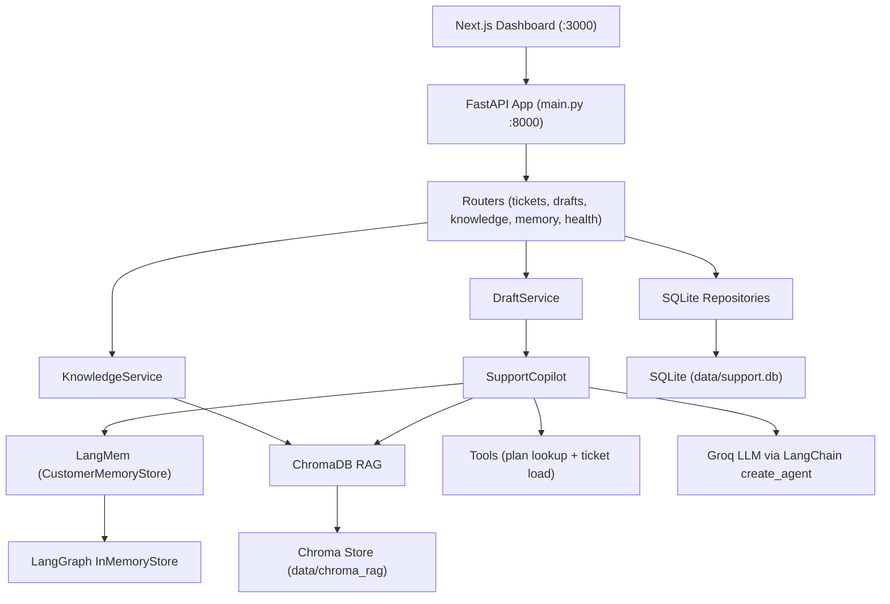

# Insurance Claims Copilot (LangMem)

An internal **human-in-the-loop** AI copilot for insurance claims adjusters. It accepts FNOL submissions, generates coverage recommendations using **LangChain agents**, **LangMem** long-term memory, and **ChromaDB RAG**, and lets licensed adjusters review and approve every draft before a claim is resolved.

Built to close the gap between upstream document/KYC automation and downstream claims operations — where adjusters still manually triage cases, search SOPs, and recall prior resolutions.

> **Not a customer-facing chatbot.** AI recommends; the adjuster decides.

---

## Why This Exists

| Layer | Problem at company | What this copilot solves |
|-------|-------------------|---------------------------|
| **Upstream (already solved)** | OCR + LLM extracted fields from ID/policy docs | — |
| **Downstream (the gap)** | Adjusters manually triage FNOL, search SOPs, recall prior cases | LangChain agent orchestrates multi-step reasoning with tools |
| **Context & memory** | Prior claim resolutions live in adjuster notes, not reusable | LangMem stores accepted resolutions per customer/company scope |
| **Policy knowledge** | SOPs and FAQs scattered across documents | ChromaDB RAG retrieves relevant KB chunks at draft time |
| **Compliance** | Black-box chatbots are risky in insurance | Licensed adjuster edits and approves every draft before resolution |
| **Operational checks** | Plan tier and open-claim load checked manually | Agent tools (`lookup_customer_plan`, `lookup_open_ticket_load`) |
| **Audit** | Regulators ask "why was this decision made?" | `context_used` JSON audit trail (memory + RAG + tool traces) |
| **Delivery** | AI logic tightly coupled to UI | FastAPI REST API decouples agent from Next.js / Streamlit frontends |
| **Deployment** | Needs repeatable demo/prod packaging | Docker Compose (API + dashboard) with health checks |

---

## Architecture



### End-to-end workflow

| Step | Actor | Action | System behavior |
|------|-------|--------|-----------------|
| 1 | Adjuster | Submits FNOL (claimant email, summary, description) | `POST /api/tickets` creates customer + ticket in SQLite |
| 2 | System | Triggers draft generation | `SupportCopilot.generate_draft()` runs |
| 3 | Agent | Retrieves context | Searches LangMem (customer + company scopes) and Chroma RAG (top-k KB chunks) |
| 4 | Agent | Calls tools | Looks up plan tier/SLA and open ticket load for the claimant |
| 5 | Agent | Produces recommendation | LangChain agent returns draft text + tool call traces |
| 6 | Adjuster | Reviews draft in UI | Can edit content; accept, discard, or regenerate |
| 7 | System | On accept | Ticket → `resolved`; accepted resolution saved to LangMem for future claims |

---

## Tech Stack

| Category | Technology | Role |
|----------|------------|------|
| **Agent runtime** | LangChain `create_agent` + LangGraph | Tool-calling agent with checkpointed threads |
| **LLM** | Groq (`langchain-groq`) | Fast draft generation |
| **Memory** | LangMem + LangGraph `InMemoryStore` | Long-term memory per customer/company; semantic index via Gemini embeddings (optional) |
| **RAG** | ChromaDB + `langchain-text-splitters` | Policy/SOP retrieval from `knowledge_base/` |
| **Embeddings** | Google Gemini (optional) | Vector search for RAG and memory |
| **API** | FastAPI + Uvicorn | REST endpoints for tickets, drafts, memory, knowledge |
| **Frontend** | Next.js (primary) + Streamlit (legacy) | Adjuster dashboard for FNOL intake and draft review |
| **Database** | SQLite | Customers, tickets, drafts persistence |
| **Config** | Pydantic Settings + `.env` | Typed configuration |
| **Ops** | Docker Compose, `uv`, Pytest, GitHub Actions | Containerized runs, CI tests, EC2 CD pipeline |

---

## API Reference

| Endpoint | Purpose |
|----------|---------|
| `GET /health` | Health probe |
| `POST /api/tickets` | Create FNOL ticket (+ optional auto draft) |
| `GET /api/tickets` | List all tickets |
| `GET /api/tickets/{id}` | Get ticket details |
| `POST /api/tickets/{id}/generate-draft` | Manually trigger draft generation |
| `GET /api/drafts/{ticket_id}` | Fetch latest draft for a ticket |
| `PATCH /api/drafts/{draft_id}` | Update draft content/status (`pending` \| `accepted` \| `discarded`) |
| `POST /api/knowledge/ingest` | Ingest documents into Chroma KB |
| `GET /api/customers/{id}/memories` | List customer memories |
| `GET /api/customers/{id}/memory-search` | Semantic memory search |

---

## PinakaAI Integration (Optional Context)

Designed as a complementary downstream layer to upstream document/KYC intelligence pipelines.

| System | Role | Integration opportunity |
|--------|------|-------------------------|
| **PinakaAI (upstream)** | KYC/doc intelligence — OCR, field extraction, Bedrock | Pre-fill FNOL from extracted policy/member fields |
| **This copilot (downstream)** | FNOL triage, coverage recommendation, resolution memory | Consumes verified doc output; adjuster approves final action |
| **Shared patterns** | FastAPI microservices, PostgreSQL, JWT auth, AWS/GCP deploy | Replace SQLite/mock tools with prod policy APIs and Bedrock |

---

## Prerequisites

- Python 3.11+
- [uv](https://github.com/astral-sh/uv) (recommended) or pip
- Node.js 18+ (for Next.js frontend local dev)
- Docker & Docker Compose (for containerized runs)

---

## Quick Start (Docker — recommended)

1. **Create `.env` in the project root:**

```bash
GROQ_API_KEY=your_groq_api_key
GROQ_MODEL=llama-3.1-8b-instant

# Optional — enables Gemini embeddings for RAG + memory semantic search
GOOGLE_API_KEY=your_google_api_key
```

2. **Start services:**

```bash
docker compose up -d --build
```

3. **Open the app:**

| Service | URL |
|---------|-----|
| Next.js dashboard | http://localhost:3000 |
| FastAPI (Swagger) | http://localhost:8000/docs |
| Health check | http://localhost:8000/health |

4. **Ingest the knowledge base** (via API or admin UI):

```bash
curl -X POST http://localhost:8000/api/knowledge/ingest \
  -H "Content-Type: application/json" \
  -d '{"clear_existing": false}'
```

---

## Local Development (without Docker)

### Backend

```bash
# Install dependencies
uv sync --dev

# Create .env (see Quick Start above)
cp .env.example .env

# Run API
uv run python main.py
```

API runs at http://localhost:8000.

### Frontend (Next.js)

```bash
cd frontend
cp .env.local.example .env.local
npm install
npm run dev
```

Dashboard runs at http://localhost:3000.

### Legacy Streamlit UI (optional)

```bash
uv run streamlit run app.py --server.address 0.0.0.0 --server.port 8501
```

---

## Environment Variables

| Variable | Required | Default | Purpose |
|----------|----------|---------|---------|
| `GROQ_API_KEY` | **Yes** | — | LLM provider for draft generation |
| `GROQ_MODEL` | No | `llama-3.1-8b-instant` | Groq model name |
| `GOOGLE_API_KEY` | No | — | Gemini embeddings for RAG + memory semantic index |
| `GOOGLE_EMBEDDING_MODEL` | No | `gemini-embedding-001` | Embedding model ID |
| `API_HOST` | No | `0.0.0.0` | FastAPI bind host |
| `API_PORT` | No | `8000` | FastAPI bind port |
| `NEXT_PUBLIC_API_BASE_URL` | No | `http://localhost:8000` | Frontend → API URL (set in `frontend/.env.local`) |

---

## Project Structure

```
├── main.py                          # FastAPI entrypoint
├── app.py                           # Legacy Streamlit dashboard
├── customer_support_agent/
│   ├── api/                         # FastAPI app factory, routers, schemas
│   ├── services/                    # Copilot, draft, knowledge orchestration
│   ├── integrations/
│   │   ├── memory/langmem_store.py  # LangMem adapter
│   │   ├── rag/chroma_kb.py         # ChromaDB RAG
│   │   └── tools/support_tools.py   # Agent tools
│   ├── repositories/sqlite/         # Customers, tickets, drafts
│   └── core/settings.py             # Pydantic settings
├── frontend/                        # Next.js adjuster dashboard
├── knowledge_base/                  # Policy/SOP markdown files for RAG
├── data/                            # SQLite DB + Chroma stores (gitignored)
├── tests/                           # Pytest suite
├── docs/                            # Extended documentation
├── Dockerfile
└── docker-compose.yml
```

---

## Testing

```bash
uv sync --dev
uv run pytest -q
```

CI runs the same test suite on pull requests and non-`main` pushes (see `.github/workflows/ci.yml`).

---

## Deployment

- **Docker Compose:** `docker compose up -d --build` (local or EC2)
- **GitHub Actions CD:** push to `main` triggers test → tar → SCP → remote `docker compose up` on EC2

See [docs/EC2_deployment_flow.md](docs/EC2_deployment_flow.md) for the full EC2 setup runbook.

---

## Production Readiness

**Status: Demo / POC-ready — not production-ready as-is.**

| Ready | Gap |
|-------|-----|
| Modular clean architecture | Memory = InMemoryStore (lost on restart) |
| Docker + healthchecks + CI/CD | SQLite (single-node, no HA) |
| Human-in-the-loop safety | No authentication/authorization |
| RAG + tool calling + audit context | Mock plan lookup tool |
| Graceful LLM fallbacks | BackgroundTasks not durable |

---

## Further Reading

- [docs/Project_Master_Documentation.md](docs/Project_Master_Documentation.md) — full architecture, API, and memory/RAG details
- [docs/EC2_deployment_flow.md](docs/EC2_deployment_flow.md) — AWS EC2 deployment guide

---

